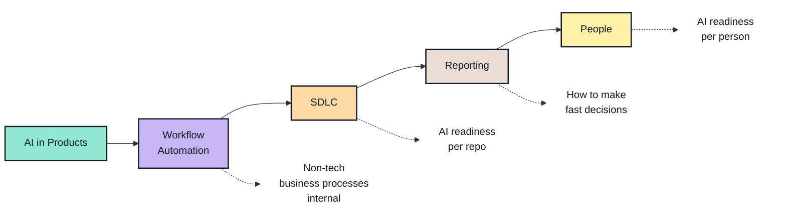

# AI Transformation Matrix

Working system for turning AI adoption into concrete checklists per company area.

GitHub supports Mermaid in Markdown via fenced `mermaid` blocks. Mermaid supports node color styling with `classDef`, which is what the matrix uses.

## Areas

- [AI in Products](docs/areas/ai-in-products.md)
- [Workflow Automation](docs/areas/workflow-automation.md)
- [SDLC](docs/areas/sdlc.md)
- [Reporting](docs/areas/reporting.md)
- [People](docs/areas/people.md)

## Hierarchy

```mermaid
flowchart TD
    matrix["AI Transformation Matrix"]:::root

    matrix --> products["AI in Products"]:::products
    matrix --> workflow["Workflow Automation"]:::workflow
    matrix --> sdlc["SDLC"]:::sdlc
    matrix --> reporting["Reporting"]:::reporting
    matrix --> people["People"]:::people

    products --> p1["Product AI opportunity map"]
    products --> p2["Customer-facing AI patterns"]
    products --> p3["Risk, trust, rollout checklist"]

    workflow --> w1["Process inventory"]
    workflow --> w2["Automation candidates"]
    workflow --> w3["Internal agent workflows"]

    sdlc --> s1["Spec"]
    sdlc --> s2["Develop"]
    sdlc --> s3["Verify"]
    sdlc --> s4["Ship"]
    sdlc --> s5["Operate"]
    sdlc --> s6["Measure"]

    reporting --> r1["Decision loops"]
    reporting --> r2["Metric ownership"]
    reporting --> r3["Weekly executive view"]

    people --> pe1["Role readiness"]
    people --> pe2["Skill ladder"]
    people --> pe3["Enablement checklist"]

    classDef root fill:#111827,stroke:#111827,color:#FFFFFF;
    classDef products fill:#8FE8D0,stroke:#111827,color:#111827;
    classDef workflow fill:#C8B6F3,stroke:#111827,color:#111827;
    classDef sdlc fill:#FFD9A3,stroke:#111827,color:#111827;
    classDef reporting fill:#E9DDD5,stroke:#111827,color:#111827;
    classDef people fill:#FFF1A8,stroke:#111827,color:#111827;
```

## Working Rules

- Each area owns one checklist doc.
- Each checklist item should say what artifact proves it is done.
- Keep steps small enough that teams can adopt them per repo, process, or person.
- Add owner/tool/source when a step depends on another system.
- Before making this repo public, add license, contribution rules, and review sensitive examples.

