# AI Transformation Matrix

Working space for AI transformation areas and the docs behind them.

```mermaid
%%{init: {"block": {"padding": 36}} }%%
block
    columns 5
    products["AI in Products"]
    workflow["Workflow Automation"]
    sdlc["SDLC"]
    reporting["Reporting"]
    people["People"]

    classDef productsClass fill:#8FE8D0,stroke:#111827,stroke-width:2px,color:#111827;
    classDef workflowClass fill:#C8B6F3,stroke:#111827,stroke-width:2px,color:#111827;
    classDef sdlcClass fill:#FFD9A3,stroke:#111827,stroke-width:2px,color:#111827;
    classDef reportingClass fill:#E9DDD5,stroke:#111827,stroke-width:2px,color:#111827;
    classDef peopleClass fill:#FFF1A8,stroke:#111827,stroke-width:2px,color:#111827;

    class products productsClass
    class workflow workflowClass
    class sdlc sdlcClass
    class reporting reportingClass
    class people peopleClass
```

## Areas

- [AI in Products](docs/areas/ai-in-products.md)
- [Workflow Automation](docs/areas/workflow-automation.md)
- [SDLC](docs/areas/sdlc.md)
- [Reporting](docs/areas/reporting.md)
- [People](docs/areas/people.md)
