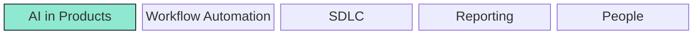

# Mermaid on GitHub

GitHub renders Mermaid diagrams inside Markdown when code is fenced with the `mermaid` language identifier.

````

````

Use `block` for equal-size, unconnected boxes. Use `classDef` for colors and attach classes with `class node className`. Avoid custom global Mermaid theme init for now because GitHub adapts Mermaid to light/dark mode, and hard-coded theme config can hurt readability.

References:

- GitHub Docs: https://docs.github.com/en/get-started/writing-on-github/working-with-advanced-formatting/creating-diagrams
- Mermaid block diagrams: https://mermaid.js.org/syntax/block.html
