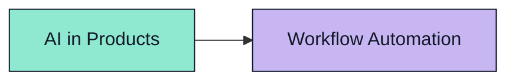

# Mermaid on GitHub

GitHub renders Mermaid diagrams inside Markdown when code is fenced with the `mermaid` language identifier.

````

````

Use `classDef` for colors and attach classes with `:::className`. Avoid custom global Mermaid theme init for now because GitHub adapts Mermaid to light/dark mode, and hard-coded theme config can hurt readability.

References:

- GitHub Docs: https://docs.github.com/en/get-started/writing-on-github/working-with-advanced-formatting/creating-diagrams
- Mermaid flowchart styling: https://mermaid.ai/open-source/syntax/flowchart.html#styling-and-classes

